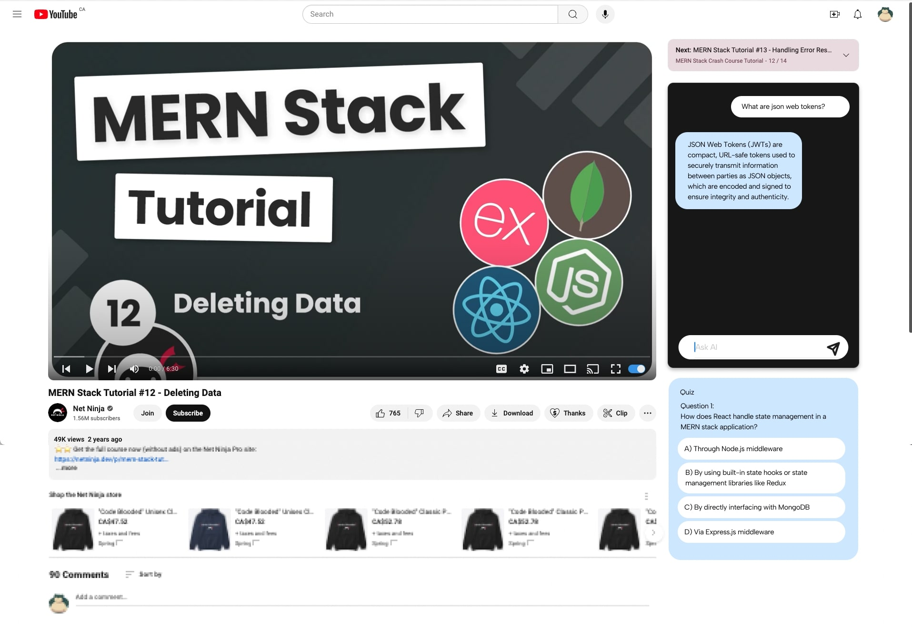

# Youtube-Learning-Mode

## Vision

The **YouTube Learning Mode** extension is designed to bridge the gap between synchronous and asynchronous learning experiences on YouTube. Traditional video consumption on YouTube is inherently asynchronous—users watch content at their own pace, and any questions that arise often require pausing the video and searching for answers externally. This process disrupts the learning flow and may lead to incomplete or inaccurate information, as search engines lack the context of the specific video.

**YouTube Learning Mode** aims to transform this asynchronous experience into a more synchronous one. By integrating AI-powered features directly into the YouTube interface, users can ask questions in real-time and receive contextually relevant answers based on the video they are watching. This creates an environment where learners can engage more deeply with the content, clarifying doubts instantly without leaving the platform.


### Frontend Figma Mockup
**Youtube Learning Mode Toggle Off**


**Youtube Learning Mode Message Sent**


**Youtube Learning Mode Quiz Answered**


[View full Figma here](https://www.figma.com/proto/1tL2i1Y62qbm56hW5J1QTp/Youtube-Learning-Mode-Prototype?node-id=2-59&t=LLPkUYyfIa6u5FHk-1)


## Use Case

### Synchronous vs. Asynchronous Learning

**Asynchronous Learning:** Traditional YouTube video consumption is a classic example of asynchronous learning. You watch content at your own pace, but if a question arises, finding the answer often means pausing the video and searching online. This search process is detached from the video, leading to a potential disconnect between the question and the relevant context within the video. As a result, learners may receive generic answers that don’t directly address their specific needs.

**Synchronous Learning:** With **YouTube Learning Mode**, we introduce synchronous elements into the YouTube learning experience. Now, as you watch a video, you can ask questions directly related to the content being viewed. The extension provides immediate, context-aware responses that keep you engaged with the material, enhancing comprehension and retention. This synchronous interaction transforms passive learning into an active dialogue between the learner and the content.

### Why Google Search Isn't Enough

While Google is an excellent tool for finding general information, it doesn't have the context of the specific video you're watching. When you search for an answer on Google, the results are based on broad keywords rather than the detailed nuances of the video content. This can lead to answers that are too general, unrelated, or even incorrect in the specific context of what you're learning.

**YouTube Learning Mode** solves this problem by staying within the video environment. It understands the content you're watching and tailors the responses to be relevant to that exact moment in the video. This ensures that your learning is more accurate, efficient, and directly applicable to the material at hand.

Imagine you're watching a tutorial, a lecture, or any educational content on YouTube. With **YouTube Learning Mode**, you can:

- **Activate Learning Mode:** A simple toggle button activates a suite of features designed to improve your learning experience.
- **Interactive Chat:** Engage in a custom chat interface where you can discuss topics, ask questions, or get clarifications.
- **Real-Time Quizzes:** Participate in quizzes that test your understanding of the content in real-time.
- **AI-Powered Q&A:** Get AI-generated answers to questions based on the video content.

Whether you're a student, a lifelong learner, or someone just curious about a specific topic, this extension is designed to make your YouTube experience more interactive and educational.

## Technologies Used

- **JavaScript:** Core language used for frontend development and scripting.
- **Google Chrome Extension APIs:** Utilized for integrating the extension into the YouTube interface.
- **Webpack:** Bundles JavaScript files into a single content bundle, ensuring that the extension is optimized and modularized.
- **Golang (Backend):** A Go-based backend may be developed to handle more complex AI-driven interactions, data storage, and processing needs.

## How to Use

### Installation

1. **Clone the Repository:**
   ```bash
   git clone https://github.com/yourusername/YouTube-Learning-Mode.git
   cd YouTube-Learning-Mode
   ```

2. **Install Dependencies:**
   Ensure you have Node.js installed, then run:
   ```bash
   npm install
   ```

3. **Build the Extension:**
   Use Webpack to bundle your JavaScript files:
   ```bash
   npx webpack --config webpack.config.js
   ```

4. **Load the Extension in Chrome:**
   - Go to `chrome://extensions/`.
   - Enable "Developer mode."
   - Click "Load unpacked" and select the `extension` folder.

### Usage

- Once the extension is loaded, go to YouTube, and you will see a new "Learning Mode" button on the video player. 
- Toggle the button to activate Learning Mode and access the interactive chat and other features.

## Future Additions

- **Advanced AI Features:** Integration with AI models to provide more accurate and context-aware responses during Q&A.
- **Expanded Quiz Features:** More robust quiz functionalities, including personalized quizzes based on the content watched.
- **Performance Analytics:** Provide users with analytics on their engagement, such as how well they performed on quizzes or how much they interacted with the video content.
- **Cross-Platform Support:** Extend the functionality of the extension to other browsers and possibly to mobile platforms.

## Contributing

Contributions are welcome! If you have ideas for new features or improvements, please open an issue or submit a pull request. 

## Frontend Figma Mockup


