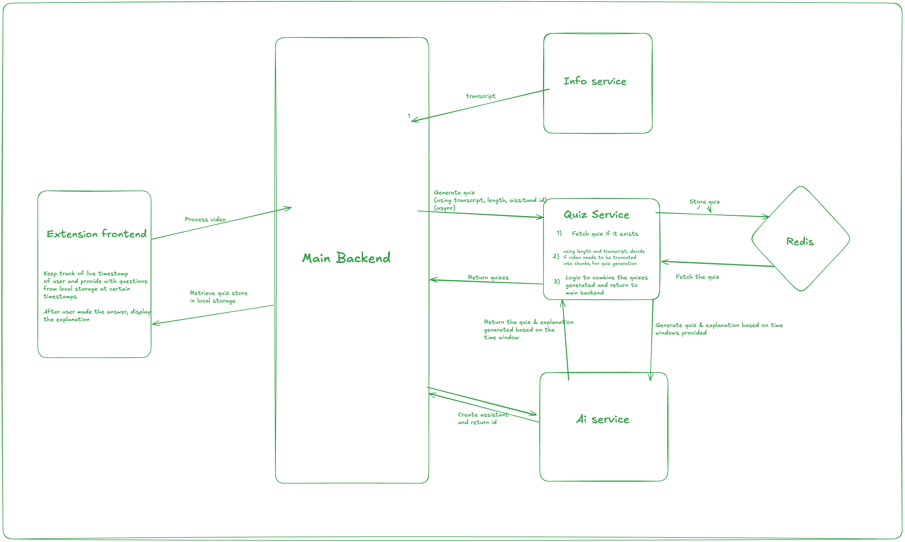

# Quiz Feature Planning

## **Objective**

The quiz service aims to enhance user engagement, learning, and knowledge retention by dynamically generating, delivering, and evaluating quizzes based on video content. It serves as a dedicated microservice that integrates seamlessly with the existing infrastructure, leveraging AI capabilities to create meaningful interactions and educational experiences.

---

## **Analysis of Current System Structure**

### **Main Backend**

- **Responsibilities:**
    
    - Handles user requests from the extension or web interface.
        
    - Manages session data and interacts with various services, including AI Service.
        
- **Key Components:**
    
    - `cmd/`: Entry points for the application, defining how the backend starts and operates.
        
    - `pkg/`: Contains packages for routing, data handling, and integration logic.

### **AI Service**

- **Responsibilities:**
    
    - Processes AI-specific tasks such as question answering and contextual understanding.
        
    - Leverages OpenAI's GPT models to generate responses.
        
- **Key Components:**
    
    - `cmd/`: Main entry points for AI-specific services.
        
    - `pkg/`: Contains core logic for AI interaction, Redis caching, and OpenAI API integration.
        

### **YouTube Info Service**
- **Responsibilities:**
    
    - Fetches video metadata and transcripts from the YouTube API.

- **Key Components:**
    
    - `app/main.py`: Hosts the FastAPI application and includes the routes.
        
    - `app/service.py`: Retrieves the transcript along with other info of the video.

    - `app/routes.py`: Exposes an endpoint /video-info/{video_id} to retrieve video metadata and transcripts.
    
    ---

## **Implementation Options**


### **Option 1: Quiz questions generated at the beginning of each video**

- **Description:**

    -In this approach, the entire quiz is generated at the start of the video based on the full transcript. The quiz will consist of a pre-determined number of questions that cover the key points of the entire video, along with explanation for each option.

- **Advantages:**

    -Existing prototypes, such as quizlet.

    -Easier to implement.

- **Disadvantages:**

    -Processing the entire transcript at once can be computationally expensive.

    -Doesn't adapt to the user’s engagement or focus during the video.


### **Option 2: Dynamic Quiz Generation Based on Timestamp**

- **Description:**

    -In this approach, quiz questions are generated dynamically as the user progresses through the video. Questions are created based on the relevant part of the transcript corresponding to the current timestamp.

- **Advantages:**

    -Questions are tailored to the user’s current position in the video, enhancing engagement.

    -Encourages users to pay attention to specific sections of the video.

- **Disadvantages:**

    -Requires real-time processing and integration with timestamp-based logic.

    -logic could be complicated, regarding which amount of transcripts before and after the timestamp being used.


## **Architecture and Data Flow**

### **API Routes**

1. **Fixed quiz**

 - **Endpoint:** `POST /generate-quiz`
        
    - **Description:** Generates the full quiz based on the entire transcript and metadata.
        
    - **Input:**
        
        - Video ID
        - Full transcript
        - Video metadata(Especially length of video)
        
    - **Response Payload:**
        
        - Unique quiz ID
        - List of questions with options, correct answers, and explanations.


- **Endpoint:** `GET /quiz/{quiz_id}`

    - **Description:** Retrieves a previously generated quiz by its unique ID.  

      

- **Endpoint:** `GET /quiz/`
    - **Description:** Lists all stored quizzes.  


 - **Endpoint:** `DELETE /quiz/{quiz_id}`
    - **Description:** Deletes a quiz by its ID.

2. **Dynamic quiz**

 - **Endpoint:** `POST /generate-question`
        
    - **Description:** Generates a single question dynamically based on the current timestamp.

    - **Request Payload:**
        
        ```
        {
          "video_id": "<video_id>",
          "current_timestamp": <timestamp>,
          "transcript": "<transcript>"
          "metadata": <metadata>
        }
        ```
        
    - **Response Payload:**
        
        ```
        {
          "quiz_id": "<quiz_id>",
          "video_id": "<video_id>",
          "question": {
                "question_text": "Which the options below best describes js?",
                "options":  ["Option 1", "Option 2", "Option 3", "Option 4"],
                "correct_answer": 1
            }
        }
        ```

- **Endpoint:** `GET /quiz/{quiz_id}`

    - **Description:** Get explanation for the right answer and also why each wrong answer is not right.  

    - **Request Payload:**
        
        - Video ID
        - Current timestamp
        - Transcript

    - **Response Payload:**
        - One question related to the timestamp
        - Options and explanation of each.

### **Data Flow**

1. User request a quiz or a question to be generated.

2. Main Backend forwards the request to the quiz service.

3. Quiz service generates the quiz/question along with explanation and stores it in database, returing it to the main backend. Or, quiz/question is retrieved from the database and returned to the main backend.

4. Main Backend delivers the response to the extention to render.

5. After user made the choice, extention show the result, and explanation for each option.

## **Error Handling**

1. **Failed to get Transcripts:**

    -Notify the user about the transcript issue.


## **Scalability and Performance Considerations**

1. Use Redis for caching quizzes, transcipt for specific videos, so that when user comes back to the video or other users watch the same video can use the generated quizzes and questions.

## **Display Plan**

- Integrate the summary feature into the existing interface:

    - **Extension:** Add a "Generate quiz/question" button in the video player controls.
        
    - **Web Interface:** Display summaries in a dedicated section below the video.

    ---

## **Architectural Decision Record (ADR)**

### **Title:** Quiz Feature

### **Status:**

Proposed

### **Context:**

The Quiz feature aims to enhance user engagement by generating real-time quizzes that are relevant to the video.

### **Decision:**

Implement the whole quizzes generation. Quiz Service, retrieves the quiz if there's quiz existing for the associated video,or fetches the transcript, metadata, length of video from Info Service. Devide into windows if longer than 1 hour, and use AI Service to generate quiz and explanation for each opton for each window, combine if necessary. Finally, storing the quiz in redis and return to main backend and then the extention.



### **Rationale:**

- Easier to implement.

- Easier to store and retrieve since timestamp is less dynamic.

### **Trade-offs:**

- If a user is watching a long video, the questions might not be instantly relevant.

- To address long video, for videos longer than 1 hour, transcript is divided into manageable chunks and each chunk is processed independently for quiz generation.

- Each generated question is assigned a timestamp which correspond to the section it relates to. But the logic could be complicated.
---
## **Acceptance Criteria**

1. A detailed ADR outlining the feature’s requirements, proposed implementation, and trade-offs.
    
2. Documentation of the current architecture and how the Video Summary feature fits into it.
    
3. A clear explanation of whether the feature will be handled in the Main Backend or AI Service.
    
4. Defined API endpoints or routes required for the feature.
    
5. A plan for handling errors or edge cases, such as incomplete transcripts or very long videos.
    

---

## **Next Steps**

1. Finalize the ADR and share it with stakeholders for approval.
    
2. Begin implementation of the API endpoints in both the Main Backend and AI Service.
    
3. Test the feature for scalability, performance, and user experience.
    
4. Deploy the feature and monitor usage for feedback and further improvements.
Col


